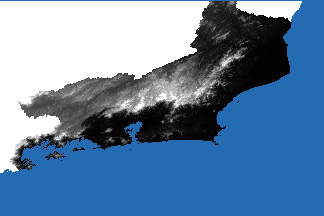
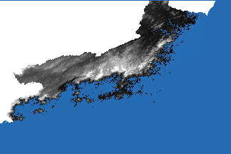
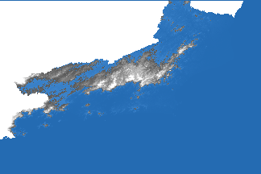
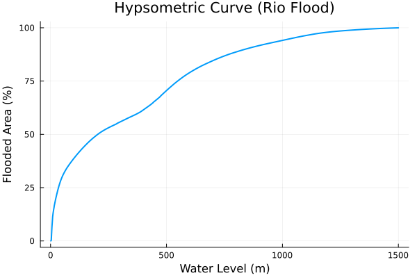
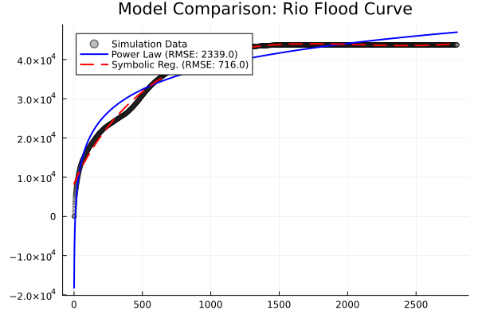
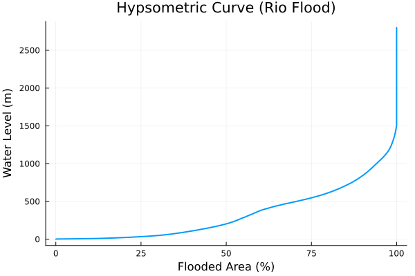

# Computational Physics: Rio de Janeiro Flood Simulation

## 1. Introduction
The objective of this project was to develop a "Water Physics Engine" capable of simulating realistic flooding scenarios on complex terrains. Using the state of Rio de Janeiro as a case study, a high-resolution topographic data is processed to model how water propagates through the landscape at varying elevation levels. The simulation provides both visual insights into flood-prone regions and quantitative data on the relationship between water level and total flooded area.

## 2. Methodology & Physics Engine

### 2.1 Terrain Representation (The "Earth Matrix")
To simulate physics on a real-world scale, the terrain was represented as a discrete numerical matrix ($M_{earth}$).
* **Grid Construction:** A 3x3 grid of TOPODATA (`.tif`) tiles (1 arc-second resolution, 900m² per pixel) are to cover the entire state of Rio de Janeiro and surrounding areas (with an exception to the topmost region of the state to reduce memory consuption).
* **State Isolation:** Using IBGE vector data (`.shp`), a boolean mask is generated to isolate the state territory. Areas outside Rio de Janeiro were treated as high barriers (3000m walls), while the ocean was set to a negative value (-1) to handle boundary conditions.
* **Resolution:** The final matrix resulted in a $10800 \times 16200$ grid, representing approximately 175 million data points, each corresponding to a specific geographic coordinate and altitude.

### 2.2 The Flood Algorithm (Physics Logic)
The core simulation relies on a **recursive flood-fill algorithm** (modified Breadth-First Search/DFS) rather than a simple planar cut.

* **Logic:** Water does not simply appear at all points below the set height; it must *flow* from a source.
* **Propagation:** The algorithm initiates at a seed point (the ocean/coastline) with a defined water level.
* **Neighbor Check:** For every flooded pixel $(i, j)$, the engine checks its 4 immediate neighbors (North, South, East, West).
* **Condition:** A neighbor is flooded if and only if:
    1.  It is not already flooded.
    2.  Its elevation $E_{neighbor} \le L$ (Water Level).
    3.  It is strictly connected to an already flooded path (ensuring valleys protected by natural levees are not flooded).

## 3. Data Sources
Given the short lifespan of the project, it's built fully based on crossed data from [TOPODATA](http://www.dsr.inpe.br/topodata/) and [IBGE - Bases cartográficas contínuas (Versão 2025)](https://www.ibge.gov.br/geociencias/downloads-geociencias.html?caminho=cartas_e_mapas/bases_cartograficas_continuas/bc250/versao2025/) as they are both national databases that seem to correlate well.

### 3.1 Treating **TOPODATA** data
Using the .tif files from **TOPODATA** comes with a lack of metadata issue. In this project the coordenates are injected in the final map to align with the borders provided by **IBGE**. As the latitude and longitude coordinates are clearly described in both databases documentations (present in the `data/` directory) it's trivial to inject the CRF info into the Raster (once the concept in understood :3)

## 4. System Architecture
Though the project wasn't incorporated as a proper Julia Project, it tries to maintain a modular structure to better it's visualization.

The program should be run at it's root, runnnig src/add_requirements.jl as well as src/src.jl to load all of it's functions.

The `tests.ipynb` file provides a sample code to understand and preview the functionalities of the project. As well as run the simulations for the study case of Rio De Janeiro

## 5. Results & Analysis

### 5.1 Visualization of Flooding
The simulation successfully visualized the progression of water encroachment across the state.
* **Coastal Inundation:** At lower levels (0-50m), the simulation accurately depicted the flooding of the Baixada Fluminense and the intricate coastline of Guanabara Bay.
* **Valley Filling:** As the water level increased, the algorithm demonstrated the "fingering" effect of water moving up river valleys (like the Paraíba do Sul) before spilling over into adjacent basins.

Reduced quality

Natural coastline at 0% of flooded area

50 meter flood at 30% of flooded area

500 meter flood at 70% of flooded area

### 5.2 The Hypsometric Curve
By running the simulation iteratively from 0m to 1500m (in 5m steps), a **Hypsometric Curve** is generated for the state. This curve plots **Water Level (m)** vs. **Flooded Area (%)**. The flooded area gets very close to 100% around 1400 meters, but the highest point in Rio De Janeiro would be around 2800 meters

The data revealed a non-linear relationship:
1.  **Initial Rapid Rise:** A sharp increase in flooded area at low elevations, corresponding to the flat coastal plains.
2.  **Plateau/Slowing:** A deceleration in area growth as the water hits the steep escarpments of the Serra do Mar.
3.  **Expansion:** Continued growth as high-altitude plateaus (Planalto) become submerged.

### 5.3 Mathematical Modeling
To generalize the behavior of the flood physics, the simulation data is approximated using two approaches (this time using absolute area values and an extended max height for better results):

1.  **Power Law Fit ($LsqFit.jl$):**
    a model of the form $A(h) = a \cdot h^b + c$. This provided a robust baseline, capturing the general scaling of the terrain's volume.

2.  **Symbolic Regression (AI-Discovery):**
    Using `SymbolicRegression.jl`, the regression searches for the precise equation that governs the topography of Rio de Janeiro. The AI explored a space of operators ($+, -, *, /, \exp, \log$) to find a function that balances accuracy (low RMSE) with complexity. The resulting formula provides a compact mathematical "signature" of the state's geography.

After comparison, neither approaches got the "bump" in the middle of the curve quite right, with the **Symbolic Regression** method performing better.

The final curve equation stayed at

$y = 9342.1 - ((x₁ * ((x₁ * ((sqrt(x₁) * -0.00029897) + 0.019368)) + -85.355)) - (((x₁ * ((sqrt(sqrt(x₁)) * -12.058) + 25.1)) + -587.88) - 527.79))$

## 6. Conclusion
The developed program successfully translated raw geospatial data into a dynamic physical simulation. By treating the terrain as a connected graph of heights, the pitfalls of simple elevation thresholding are avoided and achieved a realistic model of hydraulic connectivity. The resulting mathematical models provide a predictive tool for estimating impacted areas at any given flood stage without the need to re-run the computationally expensive matrix simulation.

## 7. Special requirements

### Inverted curve

